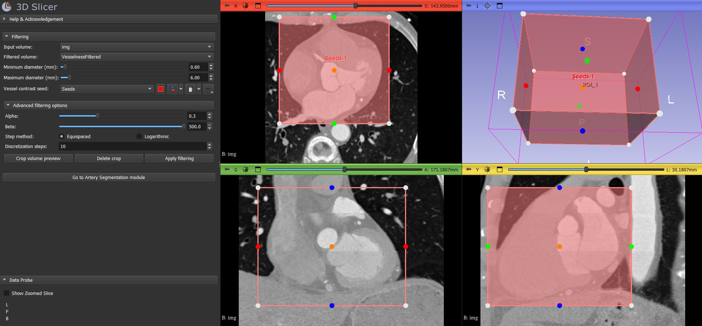
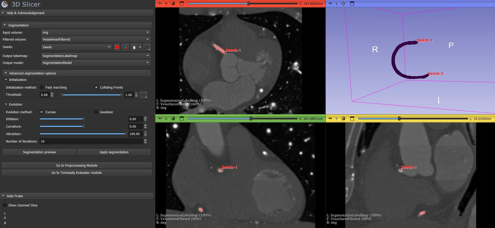
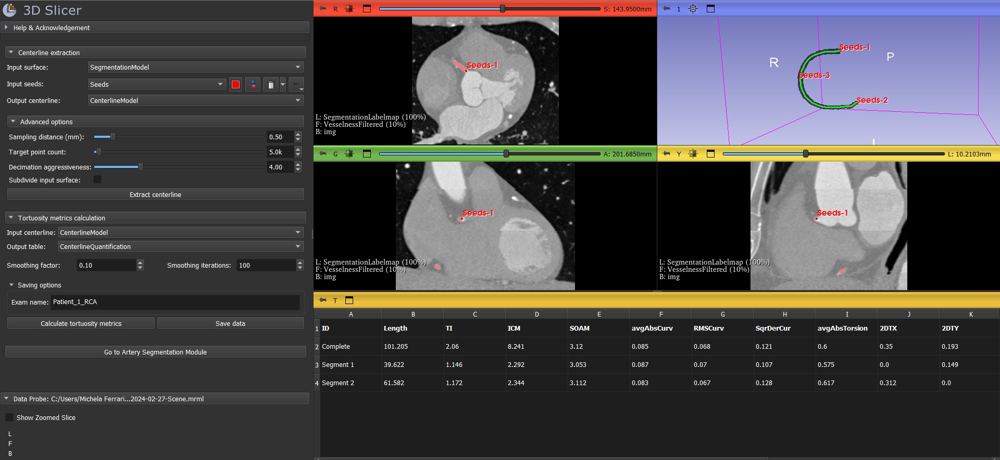

# SlicerCATE

Official Repository of the conference paper [CATE (Coronary Artery Tortuosity Evaluator): A Semi-Automatic Tool for Quantitative Assessment of Coronary Artery Tortuosity from CT Angiography](https://ieeexplore.ieee.org/document/10596810) presented at the IEEE International Workshop on Medical Measurement and Applications (MEMEA) 2024.

SlicerCATE (Coronary Artery Tortuosity Evaluator) is a 3D Slicer extension designed to analyze Coronary Computed Tomography Angiography (CCTA) images. It extracts geometric characteristics of coronary vessels to generate indices and metrics for assessing coronary artery tortuosity. The workflow is divided into three modules:
- Preprocessing
- Artery Segmentation
- Tortuosity Evaluator

## Installation

The extension has been tested on Windows and Linux with 3D Slicer >= 5.4.0; it has macOS support but has not been tested yet. For installation, use the following instructions:

1) Install [3D slicer ](https://download.slicer.org/).
2) Install [SlicerVMTK](https://github.com/vmtk/SlicerExtension-VMTK) extension using `Extension Manager`.
3) Download CATE extension from [releases page](link) and extract to your desired location.
4) In the Slicer App, select the `Welcome to Slicer` drop-down menu in the toolbar at the top and navigate to `Developer Tools > Extension Wizard`.
5) Click on `Select Extension` and locate the `SlicerCATE` folder extracted at step 2. Accept if asked to add the new modules.

## Usage

From the  `Welcome to Slicer` drop-down menu, under the `SlicerCATE` sub-menu, the three above modules are added. First, load your CCTA image file.

### Preprocessing

In the `Preprocessing` module you can perform Frangi vesselness filtering for the enhancement of tubular structures. 

Here you can:
- Select the Input volume and create a node to store the filtering result (Filtered volume)
- Choose the minimum and maximum diameter of the vessel you want to identify (default values are ok for most of the coronary arteries)
- Place a seed inside the vessel (this is needed to analyize the contrast between the vessel and the background)
- Crop the volume using the `Crop volume preview` button (it creates a ROI that you can modify or delete)
- Change the advanced settings for Frangi filter parameters (use the tooltip to get more details)
- Start the filtering operation with the `Apply filtering` button

### Artery segmentation

In the `Artery Segmentation` module you can perform Level Set Segmentation as in `SlicerVMTK`.

Here you can:
- Select the Input (original) volume and Filtered volume
- Place at least two seeds to identify the vessel endpoints
- Create a node to store the binary labelmap (Output labelmap) and one to store the 3D surface model (Output model)
- Change the advanced setting for Level Set Segmentation (use the tooltip to get more details)
- Create a preview of the surface model with the `Segmentation preview` button
- If the preview is ok, perform the segmentation using the `Apply segmentation` button

### Artery segmentation

In the `Tortuosity Evaluator` module you can compute different tortuosity indices for a single vessel at a time

This module is divided in two sections:

#### Extract centerline
Here you can:
- Select the Input surface for centerline extraction and create a node to store the final centerline (Output centerline)
- Place input seeds to identify the vessel enpoints (you can also add other seeds to identify segments of the same artery)
- Change some advaced options for centerline resampling (use the tooltip to get more details)
- Extract the centerline using the `Extract centerline` button

#### Tortuosity metrics calculation
Here you can:
- Select the Input centerline for tortuosity indices calculation
- Create a node to store the final table with all the indices
- Choose the level of smoothing to apply before indices calculation
- Extract the tortuosity indices using the `Calculate tortuosity metrics` button
- Save a final report using the the `Save data` button (you can also specify a name to identify the patient or the exam)

### Final report

The final report is saved in a directory called `SlicerCATEReportFolder`, created in the user folder. Suppose that you clicked `Save data` and choose "Patient_1_RCA" as exam name; in the report folder youn can find three files:
- Patient_1_RCA_report.pdf --> a pdf report with all the calculated indices, the plot of 2D-Trajectories and six screenshots of the 3D view of the vessel from different angles
- Patient_1_RCA_report_table.csv --> a csv file containing the tortuosity indices of the current exam
- Tortuosity_indexes_report.csv --> a csv file containing the tortuosity indices calculated for each exam name (if the file already exists, the new exam is added at the end of the file)

## Acknowledgment
- Thanks to 3D Slicer developers for making the source code of [SlicerVMTK](https://github.com/vmtk/SlicerExtension-VMTK) publicly available
- Thanks to VMTK developers for making the source code of the [Vascular Modeling Toolkit](https://github.com/vmtk/vmtk) publicly available
