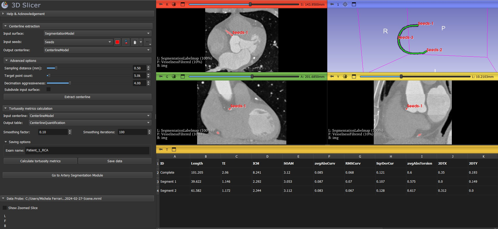

# CATE (Coronary Artery Tortuosity Evaluator)

CATE (Coronary Artery Tortuosity Evaluator) is a 3D Slicer extension designed to analyze Coronary Computed Tomography Angiography (CCTA) images. It extracts geometric characteristics of coronary vessels to generate indices and metrics for assessing coronary artery tortuosity.

We will publish the code when the final paper will be accepeted.
